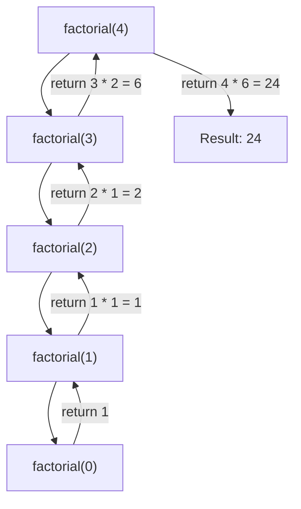
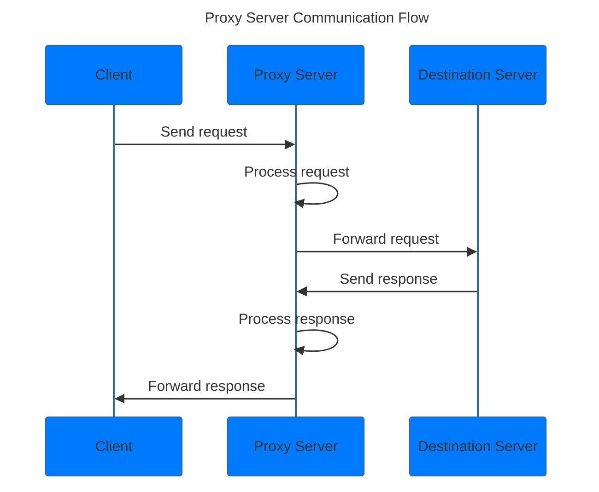

## H2 Computing Syllabus

# Section 1: Algorithms and Data Structures 
## 1.1 Algorithmic Representation 
Refer to [Introduction]((https://github.com/rawrrawrpurpledinosaur/revision_py_files/static/Introduction.pdf))
## 1.2 Fundamental Algorithms <a name="1.2"></a>
### 1.2.1 Implement [sort algorithms](https://github.com/rawrrawrpurpledinosaur/revision_py_files/blob/main/algorithms/sorting.py)
- Bubble sort 
- Bubble sort using last exchange index 
- Insertion sort  
- Quick sort 
- Merge sort 

### 1.2.3 Implement [search algorithms](https://github.com/rawrrawrpurpledinosaur/revision_py_files/blob/main/algorithms/searching.py)
- Linear search
- Binary search 
- Hash table search 

### 1.2.2 & 1.2.4 Use examples to explain sort and search algorithms 

### 1.2.5 Compare and describe the efficiencies of the sort and search algorithms using Big-O notation for time complexity (worst case)
| Algorithm | Best Case | Average Case | Worst Case |
|-----------|-----------|--------------|------------
| Bubble Sort | O(n) | O(n^2) | O(n^2) |
| Bubble Sort (Last Exchange) | O(n) | O(n^2) | O(n^2) |
| Insertion Sort | O(n) | O(n^2) | O(n^2) |
| Quick Sort | O(n log n) | O(n log n) | O(n^2) |
| Merge Sort | O(n log n) | O(n log n) | O(n log n) |


## 1.3 Data Structures <a name="1.3"></a>

### 1.3.1 - 1.3.2 Understand the concept of static and dynamic allocation of memory 
Static allocation: Memory is allocated before the program runs (compile time). Therefore, size and type of memory must be known in advance.
Dynamic allocation: Memory is allocated at runtime as needed.

### 1.3.3 Create, insert and delete operations for [stack](https://github.com/rawrrawrpurpledinosaur/revision_py_files/blob/main/data_structures/stack.py) and [queue](https://github.com/rawrrawrpurpledinosaur/revision_py_files/blob/main/data_structures/queue.py) (linear and circular) <a name="stack_queue"></a>

### 1.3.4 Understand the concept of a free space list
Free space list: A list of memory locations that are not in use and are available for allocation.

### 1.3.5 Create, update(edit, insert, delete) and search operations for [linear linked list](https://github.com/rawrrawrpurpledinosaur/revision_py_files/blob/main/data_structures/linkedlist.py)
Exclude: doubly linked list and circular linked list

### 1.3.6 Create, update(edit, insert, delete) and search operations for [binary search tree](https://github.com/rawrrawrpurpledinosaur/revision_py_files/blob/main/data_structures/tree.py)
Exclude: deletion of nodes from binary search tree

### 1.3.7 Understand pre-order, in-order and post-order tree traversal; and application of in-order tree traversal to binary search tree 
pre-order: root, left, right\  
in-order: left, root, right\  
post-order: left, right, root\  

application of in-order traversal: 
- Display all nodes in ascending order (sorted output) 

application of pre-order traversal:
- Copy a tree

application of post-order traversal:
- Deletion of nodes (out of scope)

# Section 2: Programming
## 2.1 Coding Standards
### 2.1.1 - 2.1.3 
<li> Use Indentation and white space </li>
<li> Use naming conventions </li>
<li> Write comments </li>

### 2.2.1 Types: integer, real, char, string, Boolean, arrays (1d and 2d)

### 2.2.2 Library functions for I/O, string (concatenation and slicing) and mathematical operations (+-*/%**) <a name="lib"></a>
``` py
import csv 
with open('file.csv', 'r') as f:
    reader = csv.reader(f)
    for row in reader:
        print(row)

import json 
with open('file.json', 'r') as f:
    data = json.load(f)
    print(data)
```
### 2.2.5 Understand the concept of recursion
```py 
def factorial(n):
    if n == 0: # Base case 
        return 1
    else:
        return n * factorial(n-1) # Call itself
```

### 2.2.6 Trace the steps and list results of recursive and non-recursive programs

### 2.2.7 Understand the use of stacks in recursive programming
The result of each recursive call is stored in a stack frame (which stores data necessary to execute the recursive function) until the base case is reached. The results are then popped off the stack frame and returned. </br>
Refer to above diagram, when n = 0, factorial(0) = 1. This result is popped off the stack frame and returned to the previous call, where n = 1.


## 2.3 Implementation
Literally everything in [1.2](#12-fundamental-algorithms-), [1.3](#13-data-structures-), [1.3.3](#stack_queue), [2.2.2](#lib)

## 2.4 Data Validation and Program Testing 

### 2.4.1 - 2.4.2 Explain the difference between data validation and verification 
Data validation: Checks if the data meets specific criteria or rules before it is processed, stored or used.
Done using: 
- range checks
- format check
- lengths check 
- presence check
- check digit

Data verification: Checks that data has been accurately and correctly transferred, copied or processed. 
- Comparing 2 copies of data to ensure they are identical 
- Cross checking data in a database with original source data

### 2.4.3 Identify, explain and correct syntax, logic and runtime errors 
Just pretend you are the computer and run through the code line by line.

### 2.4.4 Test cases using normal, abnormal and extreme data or testing and debugging programs
normal data: data that is within the expected range, eg: 0-100 for test scores
abnormal data: unexpected data, eg: "hello", -1, 101 
extreme data: data at the limits of the expected range, eg: 0, 100, 70 (A grade boundary value)

## 2.5 OOP 

### 2.5.1 Define and understand classes and objects
```py 
class Person: # Obviously a class, a template for creating objects
    def __init__(self, name, age):
        self.name = name # Attributes of object
        self.age = age

    def introduction(self): # Method of object
        print(f"Hi, my name is {self.name} and I am {self.age} years old.")

david = Person("David", 20) # Object (omg david is an object confirmed?!?1?)
```

### 2.5.2 Understand encapsulation and how classes support information hiding and implementation independence
Encapsulation: 
```py 
class BankAccount:
    def __init__(self, account_number, balance):
        self.__account_number = account_number  # Private attribute
        self.__balance = balance                # Private attribute

    # Public method to access the balance
    def get_balance(self):
        return self.__balance

    # Public method to deposit money
    def deposit(self, amount):
        if amount > 0:
            self.__balance += amount
            print(f"Deposited {amount}. New balance is {self.__balance}.")
        else:
            print("Invalid deposit amount.")

    # Public method to withdraw money
    def withdraw(self, amount):
        if 0 < amount <= self.__balance:
            self.__balance -= amount
            print(f"Withdrew {amount}. New balance is {self.__balance}.")
        else:
            print("Invalid withdrawal amount or insufficient balance.")
```

### 2.5.3 Understand inheritance and how it promotes software reuse
```py 
class Animal:
    def __init__(self, name):
        self.name = name

    def speak(self):
        print("I am an animal.")

class Dog(Animal): # Dog inherits from Animal
    def __init__(self, name):
        super().__init__(name)

    def speak(self): # Overriding the speak method, polymorphism
        print("Woof woof!")
```

### 2.5.4 Understand polymorphism and how it enables code generalisation
Exclude: method overload and multiple inheritance

# Section 3: Data and Information 
## 3.1 Data Representation 

### 3.1.1 Represent data in binary and hexadecimal forms

### 3.1.2 Write programs to perform the conversion of positive integers between binary, denary and hexadecimal
Refer to [conversion.py](https://github.com/rawrrawrpurpledinosaur/revision_py_files/blob/main/conversion_bin_den_hex.py)

## 3.2 Character Encoding

### 3.2.1 Give examples of where or how Unicode is used
From ChatGPT:
```
Unicode is a universal character encoding standard that represents text in most of the world's writing systems. It assigns a unique code point to every character, regardless of platform, program, or language.
Here are some examples of where and how Unicode is used:

1. Web Development
HTML and XML: Unicode is the default encoding for web content. All modern browsers support Unicode, enabling web pages to display text in different languages, special symbols, and emojis.
Example: The HTML entity &#9731; represents the Unicode character for a snowflake (❆).
JavaScript and CSS: Unicode can be used in JavaScript and CSS to work with various characters and symbols.
Example: In CSS, the content property can use Unicode to display symbols: content: "\00A9"; displays the copyright symbol (©).

2. Operating Systems
File Systems: Most modern operating systems (Windows, macOS, Linux) support Unicode for file names and paths, allowing users to name files and folders in multiple languages or with special characters.
Example: A user can create a file named "Résumé.txt" on their computer, and it will be correctly handled and displayed.
Command Line Interfaces: Unicode allows the command line to display characters from different scripts and symbols.
Example: The Windows Terminal or Unix-based terminals can display various Unicode characters, such as accented letters or emojis.

3. Programming Languages
String Handling: Programming languages like Python, Java, JavaScript, and many others use Unicode for string handling. This ensures that applications can handle a wide range of characters from different languages.
Example: In Python, you can define a Unicode string: u = "こんにちは"
```

### 3.2.2 Use ASCII code in programs 
```py 
def caesar_cipher(text): #ROT 13 
    result = ""
    for char in text:
        if char.isalpha():
            ascii_code = ord(char)
            if char.islower():
                ascii_code = (ascii_code - 97 + 13) % 26 + 97
            else:
                ascii_code = (ascii_code - 65 + 13) % 26 + 65
            result += chr(ascii_code)
        else:
            result += char
    return result
```

## 3.3 DBMS

### 3.3.1 Determine the attributes of a database: table, record and field.
- Table: A collection of records (rows) 
- Record: A collection of fields (columns)
- Field: A single piece of data in a record

### 3.3.2 Explain the purpose of and use primary, secondary, composite and foreign keys in tables.
- Primary key: A unique identifier for each record in a table 
- Composite key: A combination of 2 or more columns that uniquely identifies a record
- Foreign key: A column in a table that references the primary key in another table

### 3.3.3 Explain with examples, the concept of data redundancy and data dependency.
Data redundancy: Same data stored more than once 
Data dependency: When data in one table depends on data in another table, eg: foreign keys

### 3.3.4 Reduce data redundancy to third normal form (3NF).
1NF: Each column in a table must be atomic (single value)
| STUDENTID | NAME | SUBJECT | 1 NF? |
|-----------|------|---------|-------|
| 1         | John | Math, Econs   | No    |
| 1         | John | Math          | Yes   |

2NF: Table must be in 1NF and all non-key attributes must be fully dependent on the primary key 
| STUDENTID | NAME | SUBJECTID | TEACHER |
|-----------|------|---------|---------|
| 1         | John | 1       | Mr Tan  |
| 1         | John | 2       | Mr Lim  |

In this example, (STUDENTID, SUBJECTID) is composite key. However, TEACHER only depends on subject, therefore it is not in 2NF.</br> 
To resolve this, we can split the table into 2: 
| STUDENTID | NAME | SUBJECTID |
|-----------|------|---------|
| 1         | John | 1       |
| 1         | John | 2       |

| SUBJECTID | TEACHER |
|-----------|---------|
| 1         | Mr Tan  |
| 2         | Mr Lim  |

3NF: Table must be in 2NF and no transitive dependencies (non-key attributes depend on other non-key attributes)
| STUDENTID | SUBJECTID | EXAMNAME | TOTALMARKS |
|-----------|-----------|----------|------------|
| 1         | 1         | Midterm  | 50         |
| 1         | 1         | Final    | 100        |

Here, TOTALMARKS depends on EXAMNAME, which is not a key. To resolve this, we can split the table into 2:
| STUDENTID | SUBJECTID | EXAMNAME |
|-----------|-----------|----------|
| 1         | 1         | Midterm  |
| 1         | 1         | Final    |

| EXAMNAME | TOTALMARKS |
|----------|------------|
| Midterm  | 50         |
| Final    | 100        |


### 3.3.5 Draw entity-relationship (ER) diagrams to show the relationship between tables.
```mermaid 
erDiagram
    PERSON ||--|| PASSPORT : has
    AUTHOR ||--|{ BOOK : writes
    BOOK }|--|| PUBLISHER : "published by"
    STUDENT ||--|{ STUDENT_CLASS : has
    CLASS ||--|{ STUDENT_CLASS : contains

    
    PERSON {
        int person_id
        string name
        date birth_date
    }
    PASSPORT {
        int passport_id
        int person_id
        string passport_number
        date expiry_date
    }
    AUTHOR {
        int author_id
        string name
        string biography
    }
    BOOK {
        int book_id
        string title
        int author_id
        int publisher_id
    }
    PUBLISHER {
        int publisher_id
        string name
        string address
    }
    STUDENT {
        int student_id
        string name
        string email
    }
    CLASS {
        int class_id
        string class_name
        string semester
        int max_capacity
    }
    STUDENT_CLASS {
        int student_class_id
        int student_id
        int class_id
        date enrollment_date
    }
```

### 3.3.6 Understand how NoSQL database management system addresses the shortcomings of relational database management system (SQL).
### 3.3.7 Explain the applications of SQL and NoSQL.
### 3.3.8 Use a programming language to work with both SQL and NoSQL databases. [Guide](https://github.com/rawrrawrpurpledinosaur/revision_py_files/blob/main/static/Quick%20Reference%20Guide.pdf)
### 3.3.9 Understand the need for privacy and integrity of data.
### 3.3.10 Describe methods to protect data.
### 3.3.11 Explain the difference between backup and archive.
- Backup: A copy of data that can be used to restore the original data in case of loss or corruption
- Archive: A copy of data that is stored for long-term retention and is not intended to be used for recovery purposes
### 3.3.12 Describe the need for version control and naming convention.
### 3.3.13 Explain how data in Singapore is protected under the Personal Data Protection Act to govern the collection, use and disclosure of personal data. 

## 3.4 Social, Ethical, Legal and Economic Issues

left intentionally blank

# Section 4: Computer Networks

## 4.1 Fundamentals of Computer Networks

### 4.1.1 Explain the concepts of LAN, WAN, intranet and the structure of the internet.
- Network: A group of devices that are connected together to communicate and share resources
- LAN: Local Area Network, a network that connects computers in a small area, eg: home, school, office
- WAN: Wide Area Network, a network that connects computers over a large geographical area, eg: country, continent
- Intranet: A private network that is only accessible to an organization's staff
- Internet: A global network of networks that connects millions of devices worldwide


### 4.1.2 Understand the concepts of IP addressing and domain name server (DNS).
- IP Addressing: A unique identifier for each device connected to a Network 
- DNS: A system that translates domain names to IP addresses

### 4.1.3 Explain the need for communication protocols in a network.
### 4.1.4 Explain how data is transmitted in a packet-switching network.
### 4.1.5 Explain client-server architecture.
C-S Network: One or more devices act as a server\  
Server: 
- Centralised storage area for resources 
- Provides service to clients in the network, and is only dedicated to such tasks
- Controls access to resources on the network 
- Filters network traffic 
Client: 
- Sends request to server and server responds accordingly 
- Does not share any resources 

### 4.1.6 Implement an iterative server with socket programming. Given the server code, students should be able to implement the client code for a given scenario, and vice-versa, e.g. for a tic-tac-toe game. 
Refer to [socket programming](https://github.com/rawrrawrpurpledinosaur/H2-Computing-Notes/tree/main/socket_prgramming)

## 4.2 Web Applications 
### 4.2.1 Describe the differences between web applications and native applications.
### 4.2.2 State and apply usability principles in the design of web applications.
### 4.2.3 Use HTML, CSS (for clients) and Python (for the server) to create a web application that is able to: 
- accept user input (text and image file uploads)
- process the input on the local server
- store and retrieve data
- display the output (as formatted text/images/table).
### 4.2.4 Test a web application on a local server

## 4.3 Network Security
### 4.3.1 Understand how malware (e.g. worms and viruses) and denial of service (DOS) attacks can compromise computer systems.
### 4.3.2 Understand how firewall (filtering function), intrusion detection system (IDS) and intrusion prevention system (IPS) can be used to restrict network access, and their limitations.

#### Malware: \[Mal\]icious soft\[ware\] that aims to damage computer systems and gain unauthorized access to use them 
| Malware | Description |
|---------|-------------|
| Virus | <li>A program that replicates itself by attaching to other programs </li> <li>Remains dormant till executed </li> <li>Replicate itself to infect other machines </li>|
| Worm | <li>Similar to virus</li> <li>Self Replicating</li> <li>No need to attach itself to a file/program</li>
| Trojan Horse | <li>Apepars as legitimate</li> <li>Runs malicious codes to damage machine after gaining access</li>
| Ransomware | <li>Encrypts files and demands ransom for decryption key</li>
| Adware | <li>Software to spam advertisements</li>
| Spyware| <li>Hidden program that secretly collects info & transmits info to attackers without user knowledge, eg: keylogger </li> |

#### Denial of Service (DOS) Attack:
- DOS attacks network to exhaust resource and bandwidth 
- System fails to fulfil legitimate requests
- Distributed DOS (DDOS) uses multiple computers (botnet) to attack a single target

#### Social Engineering: 
- Use of deception and trickery to convince users to provide access/data/violate security, eg: phishing, spam

| Protection as user | Protection as developer |
|--------------------|-------------------------|
| <li>Keep OS updated</li><li>Antivirus software</li><li>Backup and archieve importrant documents</li><li>Don't click on suspicious links/emails</li><li>Don't connect to untrusted public wifi</li> | <li>Firewall</li><li>Proxy Server</li><li>VPN</li><li>Intrusion Detection System (IDS)</li><li>Intrution Protection System (IPS)</li>

| Protection scheme | Description |
|-------------------|-------------|
| Firewall | A system to prevent unauthorized access from entering a private netowrk. Monitors and controls all incoming and outgoing traffic |
| Proxy Server | Refer to diagram below |
| VPN | Virtual Private Network, similar to proxy. Unblocks censored websites and adds encryption on data transmitted in and out. VPN controls at the network level, while proxy controls at application level.
| Intrusion Detection System (IDS) | Monitors network traffic for malicious activities or policy violations, sounds an alert but **no action** |
| Intrusion Protection System (IPS) | Monitors network traffic for malicious activities or policy violations, sounds an alert and **takes action**, by dropping packets, resetting connections, alert or quarantine |

### 4.3.3 Understand how encryption, digital signature, and authentication can ensure security of network applications.
#### Encryption: Encoding a message, such that only authorized parties can access it 
- Sender uses secret key and encryption algorithm to encrypt message
- Receiver uses secret key and decryption algorithm to decrypt message

#### Symmetric Encryption: Same key used for encryption and decryption
- Fast but low security

#### Asymmetric Encryption: 
- Public and private key, mathematically related 
- Cannot be derived from each other 
- Slower but more secure
1. Sender uses receiver's public key to encrypt 
2. Recv uses private key to decrypt 

#### Electronic Signature:
- Paper signature but digitized 
